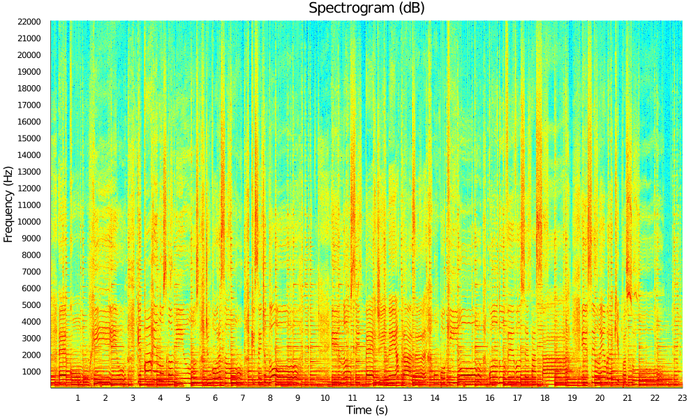
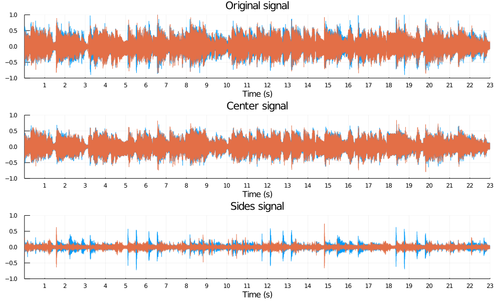
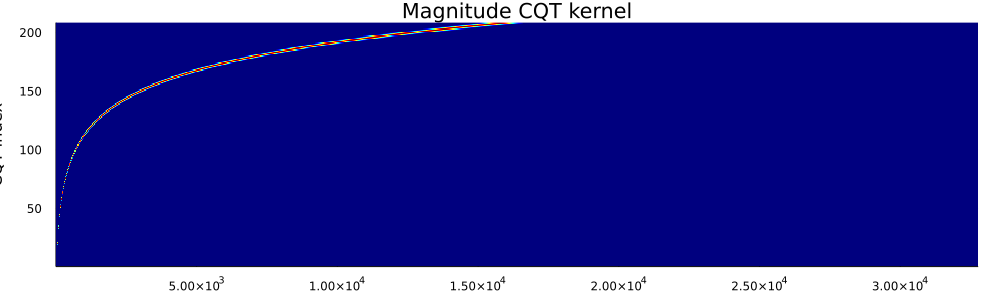

# Zaf-Julia

Zafar's Audio Functions in Julia for audio signal analysis.
- [`zaf.py`](#zafpy): Julia module with the audio functions.
- [`examples.ipynb`](#examplesipynb): Jupyter notebook with some examples.
- [`audio_file.wav`](#audio_filewav): audio file used for the examples.

## zaf.py

This Julia module implements a number of functions for audio signal analysis.

Simply copy the file `zaf.jl` in your working directory and you are good to go. Make sure to have the following packages installed (`Pkg.add("name_of_the_package")`):
- [WAV](https://juliapackages.com/p/wav): Julia package to read and write the WAV audio file format.
- [FFTW](https://juliapackages.com/p/fftw): Julia bindings to the [FFTW](http://www.fftw.org/) library for fast Fourier transforms (FFTs), as well as functionality useful for signal processing.
- [Plots](https://docs.juliaplots.org/latest/): powerful convenience for visualization in Julia.

Functions:
- [`stft`](#short-time-fourier-transform-stft) - Compute the short-time Fourier transform (STFT).
- [`istft`](#inverse-short-time-fourier-transform-stft) - Compute the inverse STFT.
- [`cqtkernel`](#constant-q-transform-cqt-kernel) - Compute the constant-Q transform (CQT) kernel.
- [`cqtspectrogram`](#constant-q-transform-cqt-spectrogram-using-a-cqt-kernel) - Compute the CQT spectrogram using a CQT kernel.
- [`cqtchromagram`](#constant-q-transform-cqt-chromagram-using-a-cqt-kernel) - Compute the CQT chromagram using a CQT kernel.
- [`mfcc`](#mel-frequency-cepstrum-coefficients-mfccs) - Compute the mel frequency cepstrum coefficients (MFCCs).
- [`dct`](#discrete-cosine-transform-dct-using-the-fast-fourier-transform-fft) - Compute the discrete cosine transform (DCT) using the fast Fourier transform (FFT).
- [`dst`](#discrete-sine-transform-dst-using-the-fast-fourier-transform-fft) - Compute the discrete sine transform (DST) using the FFT.
- [`mdct`](#modified-discrete-cosine-transform-mdct-using-the-fast-fourier-transform-fft) - Compute the modified discrete cosine transform (MDCT) using the FFT.
- [`imdct`](#inverse-modified-discrete-cosine-transform-mdct-using-the-fast-fourier-transform-fft) - Compute the inverse MDCT using the FFT.

Other:
- `hamming` - Compute the Hamming window.
- `kaiser` - Compute the Kaiser window.
- `sigplot` - Plot a signal in seconds.
- `specshow` - Display a spectrogram in dB, seconds, and Hz.
- `cqtspecshow` - Display a CQT spectrogram in dB, seconds, and Hz.
- `cqtchromshow` - Display a CQT chromagram in seconds.


### Short-time Fourier transform (STFT)

```
audio_stft = zaf.stft(audio_signal, window_function, step_length)
    
Inputs:
    audio_signal: audio signal (number_samples,)
    window_function: window function (window_length,)
    step_length: step length in samples
Output:
    audio_stft: audio STFT (window_length, number_frames)
```

#### Example: compute and display the spectrogram from an audio file

```
# Load the modules
include("./zaf.jl")
using .zaf
using WAV
using Statistics
using Plots

# Read the audio signal (normalized) with its sampling frequency in Hz, and average it over its channels
audio_signal, sampling_frequency = wavread("audio_file.wav");
audio_signal = mean(audio_signal, dims=2);

# Set the window duration in seconds (audio is stationary around 40 milliseconds)
window_duration = 0.04;

# Derive the window length in samples (use powers of 2 for faster FFT and constant overlap-add (COLA))
window_length = nextpow(2, ceil(Int, window_duration*sampling_frequency));

# Compute the window function (periodic Hamming window for COLA)
window_function = zaf.hamming(window_length, "periodic");

# Set the step length in samples (half of the window length for COLA)
step_length = convert(Int, window_length/2);

# Compute the STFT
audio_stft = zaf.stft(audio_signal, window_function, step_length)

# Derive the magnitude spectrogram (without the DC component and the mirrored frequencies)
audio_spectrogram = abs.(audio_stft[2:convert(Int, window_length/2)+1, :])

# Magnitude spectrogram (without the DC component and the mirrored frequencies)
audio_spectrogram = abs.(audio_stft[2:convert(Int, window_length/2)+1,:]);

# Display the spectrogram in dB, seconds, and Hz
xtick_step = 1
ytick_step = 1000
plot_object = zaf.specshow(audio_spectrogram, length(audio_signal), sampling_frequency, xtick_step, ytick_step);
heatmap!(title = "Spectrogram (dB)", size = (990, 600))
```




### Inverse short-time Fourier transform (STFT)

```
audio_signal = zaf.istft(audio_stft, window_function, step_length)

Inputs:
    audio_stft: audio STFT (window_length, number_frames)
    window_function: window function (window_length,)
    step_length: step length in samples
Output:
    audio_signal: audio signal (number_samples,)
```

#### Example: estimate the center and the sides from a stereo audio file

```
# Load the modules
include("./zaf.jl")
using .zaf
using WAV
using Plots

# Read the (stereo) audio signal with its sampling frequency in Hz
audio_signal, sampling_frequency = wavread("audio_file.wav");

# Set the parameters for the STFT
window_duration = 0.04;
window_length = nextpow(2, ceil(Int, window_duration*sampling_frequency));
window_function = zaf.hamming(window_length, "periodic");
step_length = convert(Int, window_length/2);

# Compute the STFTs for the left and right channels
audio_stft1 = zaf.stft(audio_signal[:,1], window_function, step_length);
audio_stft2 = zaf.stft(audio_signal[:,2], window_function, step_length);

# Derive the magnitude spectrograms (with DC component) for the left and right channels
audio_spectrogram1 = abs.(audio_stft1[1:convert(Int, window_length/2)+1, :]);
audio_spectrogram2 = abs.(audio_stft2[1:convert(Int, window_length/2)+1, :]);

# Estimate the time-frequency masks for the left and right channels for the center
center_mask1 = min.(audio_spectrogram1, audio_spectrogram2)./audio_spectrogram1;
center_mask2 = min.(audio_spectrogram1, audio_spectrogram2)./audio_spectrogram2;

# Derive the STFTs for the left and right channels for the center (with mirrored frequencies)
center_stft1 = [center_mask1; center_mask1[convert(Int, window_length/2):-1:2,:]].*audio_stft1;
center_stft2 = [center_mask2; center_mask2[convert(Int, window_length/2):-1:2,:]].*audio_stft2;

# Synthesize the signals for the left and right channels for the center
center_signal1 = zaf.istft(center_stft1, window_function, step_length);
center_signal2 = zaf.istft(center_stft2, window_function, step_length);

# Derive the final stereo center and sides signals
center_signal = hcat(center_signal1, center_signal2);
center_signal = center_signal[1:size(audio_signal, 1), :];
sides_signal = audio_signal-center_signal;

# Write the center and sides signals
wavwrite(center_signal, "center_signal.wav", Fs=sampling_frequency);
wavwrite(sides_signal, "sides_signal.wav", Fs=sampling_frequency);

# Display the original, center, and sides signals in seconds
xtick_step = 1
plot_object1 = zaf.sigplot(audio_signal, sampling_frequency, xtick_step);
plot!(ylims = (-1, 1), title = "Original signal")
plot_object2 = zaf.sigplot(center_signal, sampling_frequency, xtick_step);
plot!(ylims = (-1, 1), title = "Center signal")
plot_object3 = zaf.sigplot(sides_signal, sampling_frequency, xtick_step);
plot!(ylims = (-1, 1), title = "Sides signal")
plot(plot_object1, plot_object2, plot_object3, layout = (3, 1), size = (990, 600))
```



### Constant-Q transform (CQT) kernel

```
cqt_kernel = zaf.cqtkernel(sampling_frequency, frequency_resolution, minimum_frequency, maximum_frequency)

Inputs:
    sampling_frequency: sampling frequency in Hz
    frequency_resolution: frequency resolution in number of frequency channels per semitone
    minimum_frequency: minimum frequency in Hz
    maximum_frequency: maximum frequency in Hz
Output:
    cqt_kernel: CQT kernel (number_frequencies, fft_length)
```

#### Example: compute and display the CQT kernel

```
# Load the modules
include("./zaf.jl")
using .zaf
using Plots

# Set the parameters for the CQT kernel
sampling_frequency = 44100;
frequency_resolution = 2;
minimum_frequency = 55;
maximum_frequency = sampling_frequency/2;

# Compute the CQT kernel
cqt_kernel = zaf.cqtkernel(sampling_frequency, frequency_resolution, minimum_frequency, maximum_frequency);

# Display the magnitude CQT kernel
heatmap(abs.(Array(cqt_kernel)), fillcolor = :jet, legend = false, fmt = :png, size = (990, 300), 
    title = "Magnitude CQT kernel", xlabel = "FFT length", ylabel = "CQT frequency")
```




### Constant-Q transform (CQT) spectrogram using a CQT kernel

```
audio_spectrogram = zaf.cqtspectrogram(audio_signal, sample_rate, time_resolution, cqt_kernel)

Inputs:
    audio_signal: audio signal (number_samples,)
    sampling_frequency: sampling frequency in Hz
    time_resolution: time resolution in number of time frames per second
    cqt_kernel: CQT kernel (number_frequencies, fft_length)
Output:
    audio_spectrogram: audio spectrogram in magnitude (number_frequencies, number_times)
```


## examples.ipynb

This Jupyter notebook shows some examples for the different functions of the Julia module `zaf`.

See [Jupyter notebook viewer](https://nbviewer.jupyter.org/github/zafarrafii/Zaf-Julia/blob/master/examples.ipynb).


## audio_file.wav

23 second audio excerpt from the song *Que Pena Tanto Faz* performed by *Tamy*.


# Author

- Zafar Rafii
- zafarrafii@gmail.com
- http://zafarrafii.com/
- [CV](http://zafarrafii.com/Zafar%20Rafii%20-%20C.V..pdf)
- [GitHub](https://github.com/zafarrafii)
- [LinkedIn](https://www.linkedin.com/in/zafarrafii/)
- [Google Scholar](https://scholar.google.com/citations?user=8wbS2EsAAAAJ&hl=en)
